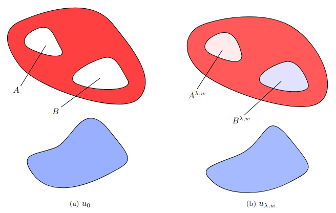

# Support recovery in total (gradient) variation regularization

  

This notebook allows to reproduce the experiments presented in the Section 5.3.2 of [[1]](https://arxiv.org/abs/2307.03709).

[[1]](https://arxiv.org/abs/2307.03709) De Castro, Y., Duval, V., & Petit, R. (2024). Exact recovery of the support of piecewise constant images via total variation regularization. Inverse Problems.
